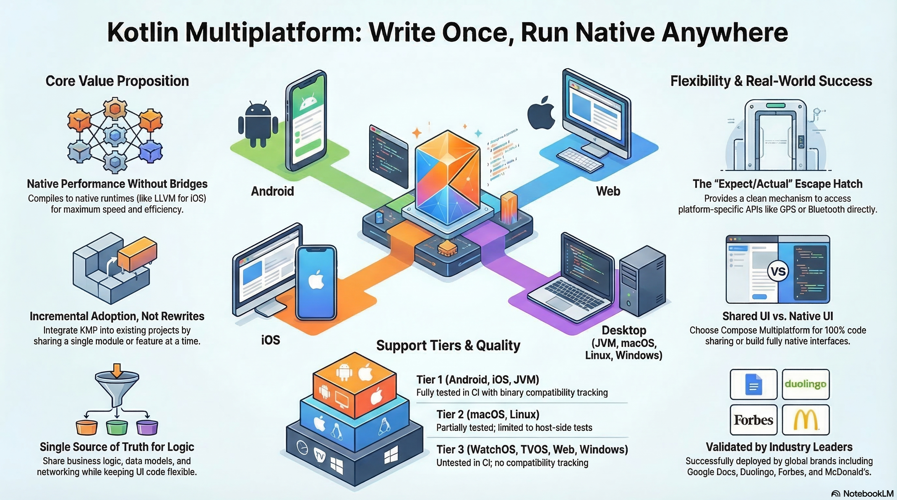

This is a Kotlin Multiplatform project targeting Android, iOS, Web, Desktop (JVM), and Server.



## Project Structure

The project is organized into the following modules:

*   **[:androidApp](./androidApp)**: The native Android application target. Contains the `MainActivity`, `AndroidManifest.xml`, and any Android-specific startup logic.
*   **[:composeApp](./composeApp)**: Serves as the main common application structure using Compose Multiplatform. It acts as the shared app entry point, bringing together the UI, features, and cross-platform setup for all client targets.
*   **[:desktopApp](./desktopApp)**: The native desktop application target for JVM. Contains the desktop window setup and entry point.
*   **[:iosApp](./iosApp)**: The native iOS application target. Contains the SwiftUI entry point and iOS-specific configurations.
*   **[:server](./server)**: The Ktor backend application. It provides the REST API endpoints and backend logic for the KMP clients to consume.
*   **[:shared](./shared)**: Contains common business logic, data models (e.g., `JournalEntry`), Ktor resources, and shared utilities utilized across all clients and the backend server.
*   **[:webApp](./webApp)**: The native web application target (Kotlin/Wasm or Kotlin/JS). Contains the web-specific entry point and configurations.

### Build and Run Android Application

To build and run the development version of the Android app, use the run configuration from the run widget in your IDE’s toolbar or build it directly from the terminal:

- on macOS/Linux
  ```shell
  ./gradlew :composeApp:assembleDebug
  ```
- on Windows
  ```shell
  .\gradlew.bat :composeApp:assembleDebug
  ```

### Build and Run Desktop (JVM) Application

To build and run the development version of the desktop app, use the run configuration from the run widget in your IDE’s toolbar or run it directly from the terminal:

- on macOS/Linux
  ```shell
  ./gradlew :composeApp:run
  ```
- on Windows
  ```shell
  .\gradlew.bat :composeApp:run
  ```

### Build and Run Server

To build and run the development version of the server, use the run configuration from the run widget in your IDE’s toolbar or run it directly from the terminal:

- on macOS/Linux
  ```shell
  ./gradlew :server:run
  ```
- on Windows
  ```shell
  .\gradlew.bat :server:run
  ```

### Build and Run Web Application

To build and run the development version of the web app, use the run configuration from the run widget in your IDE's toolbar or run it directly from the terminal:

- The Wasm target (faster, modern browsers) has been removed to keep things simple.
  
- for the JS target (slower, supports older browsers):
    - on macOS/Linux
      ```shell
      ./gradlew :composeApp:jsBrowserDevelopmentRun
      ```
    - on Windows
      ```shell
      .\gradlew.bat :composeApp:jsBrowserDevelopmentRun
      ```

### Build and Run iOS Application

To build and run the development version of the iOS app, use the run configuration from the run widget in your IDE’s toolbar or open the [/iosApp](./iosApp) directory in Xcode and run it from there.

---

Learn more about [Kotlin Multiplatform](https://www.jetbrains.com/help/kotlin-multiplatform-dev/get-started.html),
[Compose Multiplatform](https://github.com/JetBrains/compose-multiplatform/#compose-multiplatform),
[Kotlin/Wasm](https://kotl.in/wasm/)…

We would appreciate your feedback on Compose/Web and Kotlin/Wasm in the public Slack
channel [#compose-web](https://slack-chats.kotlinlang.org/c/compose-web).
If you face any issues, please report them on [YouTrack](https://youtrack.jetbrains.com/newIssue?project=CMP).
